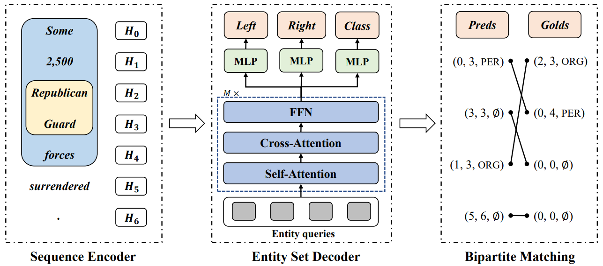

# README

Code for [our paper](https://arxiv.org/abs/2105.08901) "**A Sequence-to-Set Network for Nested Named Entity Recognition**", accepted at [IJCAI 2021](https://ijcai-21.org/).



## Setup

### Requirements

```bash
conda create --name seq2set python=3.8
conda activate seq2set
pip install -r requirements.txt
```
### Quick Start

The preprocessed GENIA dataset is [available](https://drive.google.com/file/d/13Lf_pQ1-QNI94EHlvtcFhUcQeQeUDq8l/view?usp=sharing), we use it as an example.

```bash
cd ssn
mkdir -p data/datasets
cd data/datasets
unzip genia.zip
```

### Train
```bash
python ssn.py train --config configs/example.conf
```

### Evaluation
```bash
vim configs/eval.conf
# change model_path to the path of the trained model.
# such as: model_path = data/genia/main/genia_train/time/final_model
python ssn.py eval --config configs/eval.conf
```

### Checkpoints

You can also download our [checkpoints](https://drive.google.com/drive/folders/1Bc5L2Iw58Y7KtkNH9pYEd6xhFBjicKVQ?usp=sharing) for evaluation.

```bash
cd data/
unzip checkpoints.zip
cd ../
python ssn.py eval --config configs/eval.conf
```

If you evaluate the checkpoints we provide, the results are as follows:

+ ACE05:
```
--- Entities (named entity recognition (NER)) ---
An entity is considered correct if the entity type and span is predicted correctly

                type    precision       recall     f1-score      support
                 WEA        84.00        84.00        84.00           50
                 FAC        84.43        75.74        79.84          136
                 VEH        86.67        77.23        81.68          101
                 ORG        85.03        78.20        81.47          523
                 GPE        86.53        85.68        86.10          405
                 LOC        62.71        69.81        66.07           53
                 PER        89.46        92.58        90.99         1724

               micro        87.45        87.30        87.37         2992
               macro        82.69        80.46        81.45         2992
```

+ GENIA:
```
--- Entities (named entity recognition (NER)) ---
An entity is considered correct if the entity type and span is predicted correctly

                type    precision       recall     f1-score      support
             protein        83.84        83.27        83.55         3084
                 DNA        75.91        77.42        76.66         1262
                 RNA        89.11        82.57        85.71          109
           cell_line        81.63        69.89        75.30          445
           cell_type        78.04        75.08        76.53          606

               micro        81.27        79.93        80.60         5506
               macro        81.71        77.64        79.55         5506
```

+ ACE04:
```
--- Entities (named entity recognition (NER)) ---
An entity is considered correct if the entity type and span is predicted correctly

                type    precision       recall     f1-score      support
                 WEA        80.95        53.12        64.15           32
                 FAC        75.56        60.71        67.33          112
                 PER        90.68        90.92        90.80         1498
                 ORG        84.56        83.33        83.94          552
                 VEH        94.12        94.12        94.12           17
                 GPE        88.34        87.48        87.91          719
                 LOC        73.45        79.05        76.15          105

               micro        87.86        86.82        87.34         3035
               macro        83.95        78.39        80.63         3035
```

### Datasets

The datasets used in our experiments:

+ ACE04: https://catalog.ldc.upenn.edu/LDC2005T09
+ ACE05: https://catalog.ldc.upenn.edu/LDC2006T06
+ KBP17: https://catalog.ldc.upenn.edu/LDC2017D55
+ GENIA: http://www.geniaproject.org/genia-corpus

Data format:
```json
 {
       "tokens": ["2004-12-20T15:37:00", "Microscopic", "microcap", "Everlast", ",", "mainly", "a", "maker", "of", "boxing", "equipment", ",", "has", "soared", "over", "the", "last", "several", "days", "thanks", "to", "a", "licensing", "deal", "with", "Jacques", "Moret", "allowing", "Moret", "to", "buy", "out", "their", "women", "'s", "apparel", "license", "for", "$", "30", "million", ",", "on", "top", "of", "a", "$", "12.5", "million", "payment", "now", "."], 
       "pos": ["JJ", "JJ", "NN", "NNP", ",", "RB", "DT", "NN", "IN", "NN", "NN", ",", "VBZ", "VBN", "IN", "DT", "JJ", "JJ", "NNS", "NNS", "TO", "DT", "NN", "NN", "IN", "NNP", "NNP", "VBG", "NNP", "TO", "VB", "RP", "PRP$", "NNS", "POS", "NN", "NN", "IN", "$", "CD", "CD", ",", "IN", "NN", "IN", "DT", "$", "CD", "CD", "NN", "RB", "."], 
       "entities": [{"type": "ORG", "start": 1, "end": 4}, {"type": "ORG", "start": 5, "end": 11}, {"type": "ORG", "start": 25, "end": 27}, {"type": "ORG", "start": 28, "end": 29}, {"type": "ORG", "start": 32, "end": 33}, {"type": "PER", "start": 33, "end": 34}], 
       "ltokens": ["Everlast", "'s", "Rally", "Just", "Might", "Live", "up", "to", "the", "Name", "."], 
       "rtokens": ["In", "other", "words", ",", "a", "competitor", "has", "decided", "that", "one", "segment", "of", "the", "company", "'s", "business", "is", "potentially", "worth", "$", "42.5", "million", "."],
       "org_id": "MARKETVIEW_20041220.1537"
}
```
Due to the license of LDC, we cannot directly release our preprocessed datasets of ACE04, ACE05 and KBP17. We only release the preprocessed GENIA dataset and the corresponding word vectors and dictionary.

If you need other datasets, please email `zqtan@zju.edu.cn`. Note that you need to state your identity and prove that you have obtained the LDC license.

### Pretrained Wordvecs

The word vectors used in our experiments:

+ BioWord2Vec for GENIA: https://github.com/cambridgeltl/BioNLP-2016
+ GloVe for other datasets: http://nlp.stanford.edu/data/glove.6B.zip

Download and extract the wordvecs from above links, save GloVe in `../glove` and BioWord2Vec in `../biovec`.

```bash
mkdir ../glove
mkdir ../biovec
mv glove.6B.100d.txt ../glove
mv PubMed-shuffle-win-30.txt ../biovec
```

Note: the BioWord2Vec needs to be converted to GloVe format. Refer to [the guide](https://radimrehurek.com/gensim/scripts/glove2word2vec.html).

## Citation
If you have any questions, feel free to email `zqtan@zju.edu.cn`.

```bibtex
@inproceedings{tan2021sequencetoset,
    title={A Sequence-to-Set Network for Nested Named Entity Recognition}, 
    author={Zeqi Tan and Yongliang Shen and Shuai Zhang and Weiming Lu and Yueting Zhuang},
    url = {https://arxiv.org/abs/2105.08901},
    booktitle = {Proceedings of the 30th International Joint Conference on
                 Artificial Intelligence, {IJCAI-21}},
    year = {2021},
}
```